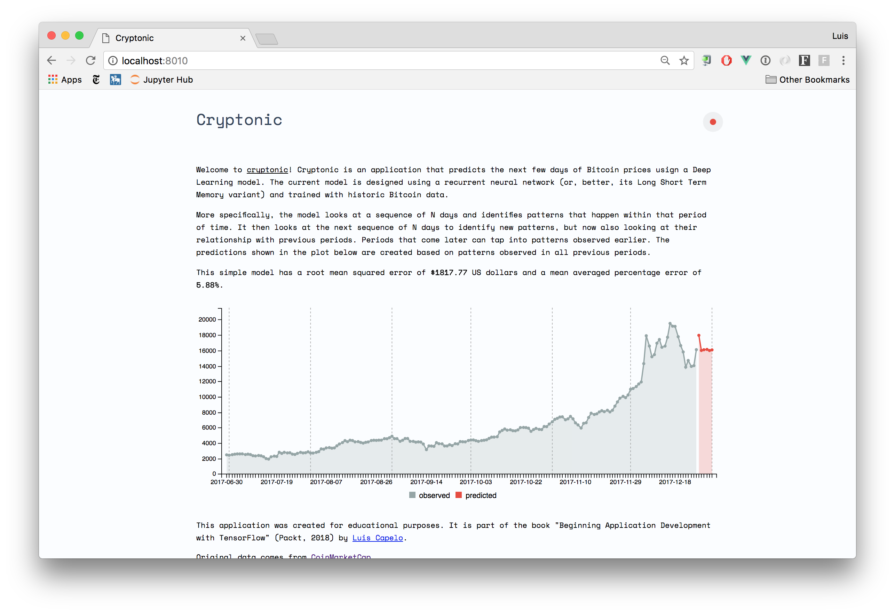

# Cryptonic
Cryptonic is a Dockerized web-application that predicts Bitcoin prices using a deep learning model. The model used to predict prices can be easily changed--given that certain parameters are passed--making it easy to experiment and deploy a working model.



The application was developed for educational purposes and is part of the book "Beginning Application Development with TensorFlow" by [Luis Capelo](https://luiscapelo.info/).

### Usage
A demo of the application is available at

* Demo: https://cryptonic.market/

### API
The application has the following endpoints:

* `/status`: returns the status of the application and its error rates.
* `/historic`: returns available Bitcoin prices up to date.
* `/predict`: predicts the next N days of Bitcoin closing prices.

### Requirements
You will need:

* Docker `17.09.1` or higher.
* If using the `Makefile` commands, you will also need `make`.

### Deployment
Deploy this application using the available `Makefile` recipes. Navigate to the application's root directory, then execute:

```shell
$ make deploy
```

Now visit http://localhost:5000 on your browser and the application should be available.